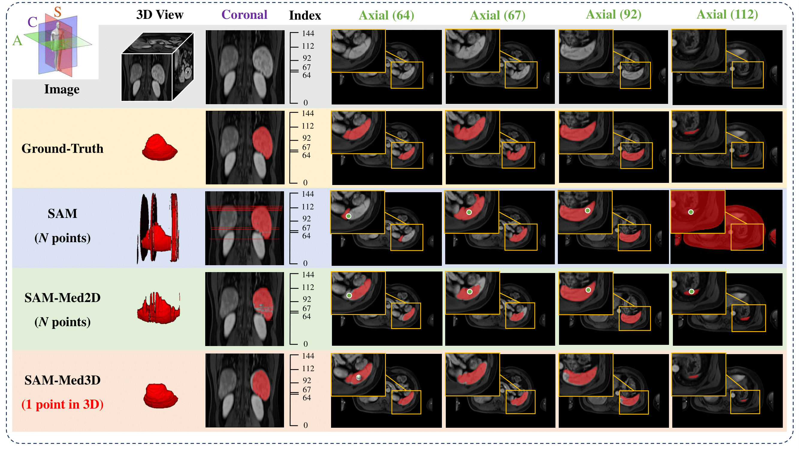
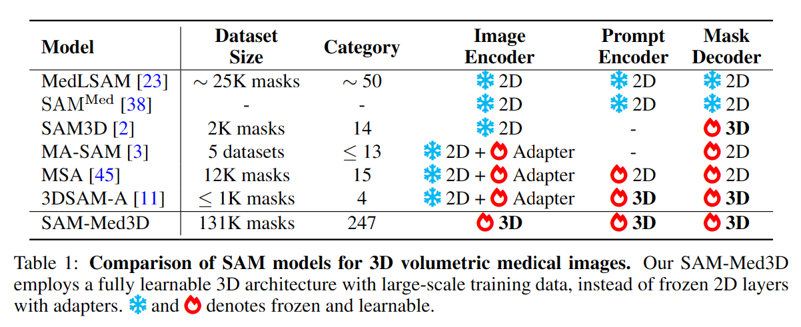
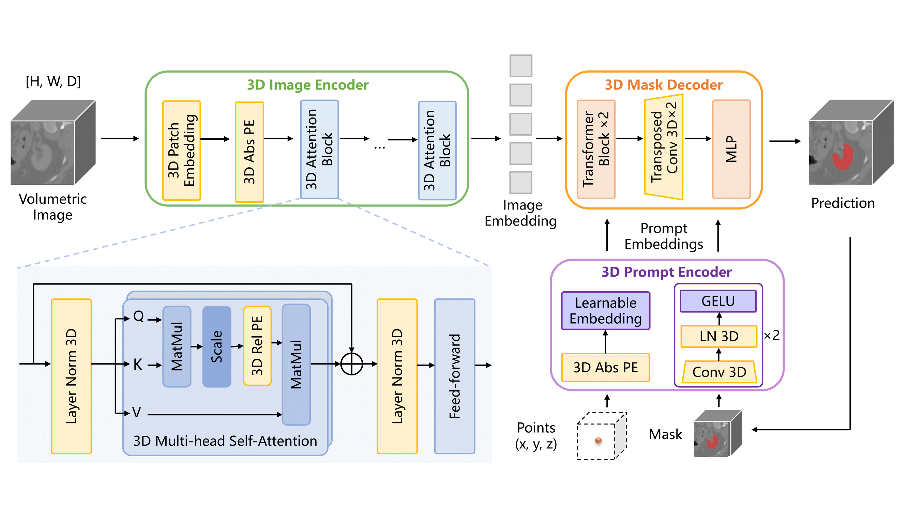
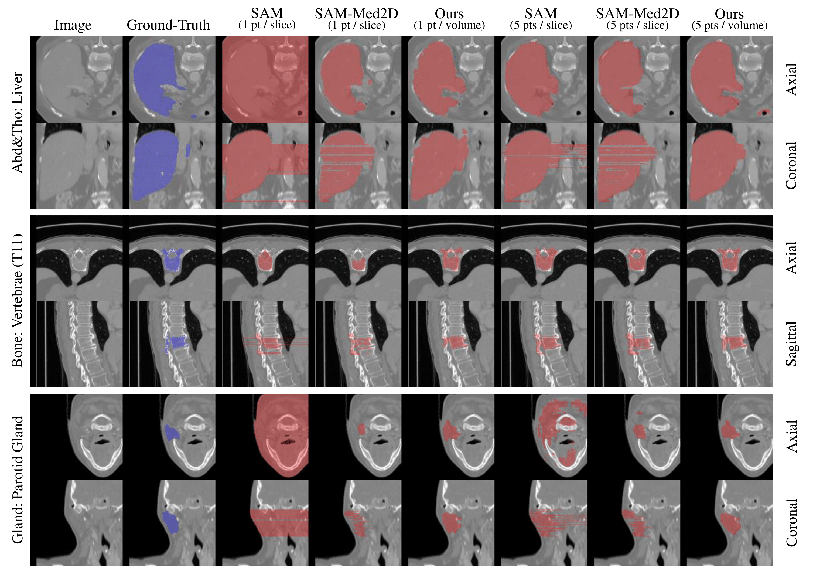
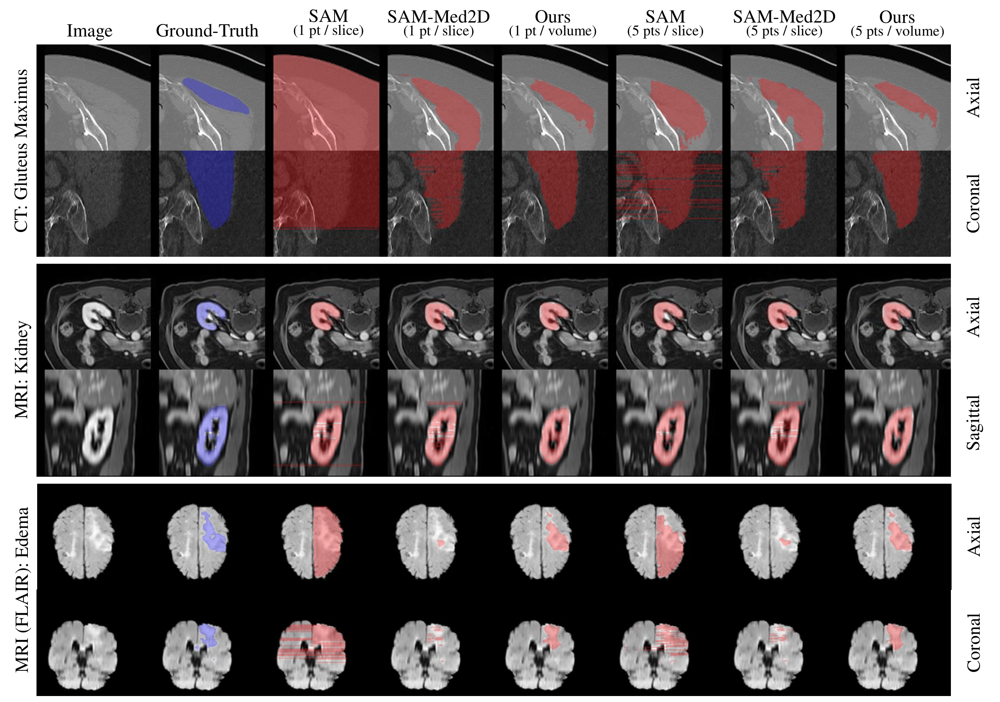

# SAM-Med3D \[[Paper](https://arxiv.org/abs/2310.15161)]


<div align="center">
  
</div>

## 🔥🌻📰 News 📰🌻🔥
- **[New Checkpoints Release]** A newer version of finetuned SAM-Med3D named `SAM-Med3D-turbo` is released now. We fine-tuned it on 44 datasets ([list](https://github.com/uni-medical/SAM-Med3D/issues/2#issuecomment-1849002225)) to improve the performance. Hope this update can help you 🙂.
- **[New Checkpoints Release]** Finetuned SAM-Med3D for organ/brain segmentation is released now! Hope you enjoy the enhanced performance for specific tasks 😉. Details are in [results](https://github.com/uni-medical/SAM-Med3D/blob/main/readme.md#-dice-on-different-anatomical-architecture-and-lesions) and [ckpt](https://github.com/uni-medical/SAM-Med3D#-checkpoint).
- **[Recommendation]** If you are interested in computer vision, 
we recommend checking out [OpenGVLab](https://github.com/OpenGVLab) for more exciting projects like [SAM-Med2D](https://github.com/OpenGVLab/SAM-Med2D/tree/main)!

## 🌟 Highlights
- 📚 Curated the most extensive volumetric medical dataset to date for training, boasting 131K 3D masks and 247 categories.
- 🚤 Achieved efficient promptable segmentation, requiring 10 to 100 times fewer prompt points for satisfactory 3D outcomes.
- 🏆 Conducted a thorough assessment of SAM-Med3D across 15 frequently used volumetric medical image segmentation datasets.

## 🔨 Usage
### Training / Fine-tuning
(we recommend fine-tuning with SAM-Med3D pre-trained weights from [link](https://github.com/uni-medical/SAM-Med3D#-checkpoint))

To train the SAM-Med3D model on your own data, follow these steps:

#### 0. **(Recommend) Prepare the Pre-trained Weights**

Download the checkpoint from [ckpt section](https://github.com/uni-medical/SAM-Med3D#-checkpoint) and move the pth file into `SAM_Med3D/ckpt/sam_med3d.pth`.


#### 1. Prepare Your Training Data (from nnU-Net-style dataset): 

Ensure that your training data is organized according to the structure shown in the `data/validation` directories. The target file structures should be like the following:
```
data/train
      ├── adrenal
      │ ├── ct_WORD
      │ │ ├── imagesTr
      │ │ │ ├── word_0025.nii.gz
      │ │ │ ├── ...
      │ │ ├── labelsTr
      │ │ │ ├── word_0025.nii.gz
      │ │ │ ├── ...
      ├── ...
```

> If the original data are in the **nnU-Net style**, follow these steps:
> 
> For a nnU-Net style dataset, the original file structure should be:
> ```
> Dataset10_WORD
>      ├── imagesTr
>      │ ├── word_0025.nii.gz
>      │ ├── ...
>      ├── labelsTr
>      │ ├── word_0025.nii.gz
>      │ ├── ...
> ```
> If the labels have multiple classes, you should first split them into multiple binary labels, then re-organize them into multiple sub-folders.
> ```
> data/train
>       ├── adrenal
>       │ ├── ct_WORD
>       │ │ ├── imagesTr
>       │ │ │ ├── word_0025.nii.gz
>       │ │ │ ├── ...
>       │ │ ├── labelsTr
>       │ │ │ ├── word_0025.nii.gz (binary label)
>       │ │ │ ├── ...
>       ├── liver
>       │ ├── ct_WORD
>       │ │ ├── imagesTr
>       │ │ │ ├── word_0025.nii.gz
>       │ │ │ ├── ...
>       │ │ ├── labelsTr
>       │ │ │ ├── word_0025.nii.gz (binary label)
>       │ │ │ ├── ...
>       ├── ...
> ```

Then, modify the `utils/data_paths.py` according to your own data.
```
img_datas = [
"data/train/adrenal/ct_WORD",
"data/train/liver/ct_WORD",
...
]
```


#### 2. **Run the Training Script**: 
Run `bash train.sh` to execute the following command in your terminal:

```
python train.py --multi_gpu --task_name ${tag}
```
This will start the training process of the SAM-Med3D model on your prepared data. If you use only one GPU, remove the `--multi_gpu` flag.

The key options are listed below:

- task_name: task name
- checkpoint: pre-trained checkpoint
- work_dir: results folder for log and ckpt
- multi_gpu: use multiple GPU with DDP
- gpu_ids: set gpu ids used for training
- num_epochs: number of epoches
- batch_size: batch size for training
- lr: learning rate for training


**Hint**: Use the `--checkpoint` to set the pre-trained weight path, the model will be trained from scratch if no ckpt in the path is found!

### Evaluation
Prepare your own dataset and refer to the samples in `data/validation` to replace them according to your specific scenario. 
Then you can simply run `bash infer.sh` to test SAM-Med3D on your data. 
Make sure the masks are processed into the one-hot format (have only two values: the main image (foreground) and the background).

```
python validation.py --seed 2023\
 -vp ./results/vis_sam_med3d \
 -cp ./ckpt/sam_med3d.pth \
 -tdp ./data/validation -nc 1 \
 --save_name ./results/sam_med3d.py
```

- vp: visualization path, dir to save the final visualization files
- cp: checkpoint path
- tdp: test data path, where your data is placed
- nc: number of clicks of prompt points
- save_name: filename to save evaluation results 

For validation of SAM and SAM-Med2D on 3D volumetric data, you can refer to `infer_sam.sh` and `infer_med2d.sh` for details.

Hint: We also provide a simple script `sum_result.py` to help summarize the results from file like `./results/sam_med3d.py`. 

## 🔗 Checkpoint
**Our most recommended version is SAM-Med3D-turbo**

| Model | Google Drive | Baidu NetDisk |
|----------|----------|----------|
| SAM-Med3D | [Download](https://drive.google.com/file/d/1PFeUjlFMAppllS9x1kAWyCYUJM9re2Ub/view?usp=drive_link) | [Download (pwd:r5o3)](https://pan.baidu.com/s/18uhMXy_XO0yy3ODj66N8GQ?pwd=r5o3) |
| SAM-Med3D-organ    | [Download](https://drive.google.com/file/d/1kKpjIwCsUWQI-mYZ2Lww9WZXuJxc3FvU/view?usp=sharing) | [Download (pwd:5t7v)](https://pan.baidu.com/s/1Dermdr-ZN8NMWELejF1p1w?pwd=5t7v) |
| SAM-Med3D-brain    | [Download](https://drive.google.com/file/d/1otbhZs9uugSWkAbcQLLSmPB8jo5rzFL2/view?usp=sharing) | [Download (pwd:yp42)](https://pan.baidu.com/s/1S2-buTga9D4Nbrt6fevo8Q?pwd=yp42) |
| SAM-Med3D-turbo    | [Download](https://drive.google.com/file/d/1MuqYRQKIZb4YPtEraK8zTKKpp-dUQIR9/view?usp=sharing) | [Download (pwd:l6ol)](https://pan.baidu.com/s/1OEVtiDc6osG0l9HkQN4hEg?pwd=l6ol) |

Other checkpoints are available with their official link: [SAM](https://drive.google.com/file/d/1_U26MIJhWnWVwmI5JkGg2cd2J6MvkqU-/view?usp=drive_link) and [SAM-Med2D](https://drive.google.com/file/d/1ARiB5RkSsWmAB_8mqWnwDF8ZKTtFwsjl/view?usp=drive_link).

## 🗼 Method
<div align="center">
  
</div>
<div align="center">
  
</div>

## 🏆 Results
### 💡 Overall Performance
| **Model**    | **Prompt**   | **Resolution**                 | **Inference Time (s)** | **Overall Dice** |
|--------------|--------------|--------------------------------|------------------|------------------|
| SAM          | N points     | 1024×1024×N                    | 13               | 17.01            |
| SAM-Med2D    | N points     | 256×256×N                      | 4                | 42.75            |
| SAM-Med3D    | 1 point      | 128×128×128                    | 2                | 49.91            |
| SAM-Med3D    | 10 points    | 128×128×128                    | 6                | 60.94            |
| **SAM-Med3D-turbo** | 10 points | 128×128×128                | 6                | 77.60            |

> **Note:** Quantitative comparison of different methods on our evaluation dataset. Here, N denotes the count of slices containing the target object (10 ≤ N ≤ 200). Inference time is calculated with N=100, excluding the time for image processing and simulated prompt generation.


### 💡 Dice on Different Anatomical Architecture and Lesions
| **Model**    | **Prompt**   | **A&T** | **Bone** | **Brain** | **Cardiac** | **Gland** | **Muscle** | **Seen Lesion** | **Unseen Lesion** |
|--------------|--------------|---------|----------|-----------|-------------|-----------|------------|-----------------|-------------------|
| SAM          | N points     | 17.19   | 22.32    | 17.68     | 2.82        | 11.62     | 3.50       | 12.03           | 8.88              |
| SAM-Med2D    | N points     | 46.79   | 47.52    | 19.24     | 32.23       | 43.55     | 35.57      | 26.08           | 44.87             |
| SAM-Med3D    | 1 point      | 46.80   | 54.77    | 34.48     | 46.51       | 57.28     | 53.28      | 42.02           | 40.53             |
| SAM-Med3D    | 10 points    | 55.81   | 69.13    | 40.71     | 52.86       | 65.01     | 67.28      | 50.52           | **48.44**            |
| **SAM-Med3D-brain** | 10 points | 51.71   | -        | **62.77** | 37.93    | 62.95     | 43.70      | 45.89           | 20.51             |
| **SAM-Med3D-organ** | 10 points | 70.63   | -        | 46.49     | 63.14| **73.01** | 75.29      | 53.02           | 36.44             |
| **SAM-Med3D-turbo** | 10 points | **83.96**|**85.34**| 46.08 |	**69.90** |	**90.97**  |	**91.62**      |	**64.80** | **61.00**     |

> **Note:** Comparison from the perspective of anatomical structure and lesion. A&T represents Abdominal and Thorax targets. N denotes the count of slices containing the target object (10 ≤ N ≤ 200).


### 💡 Visualization
<div align="center">
  
</div>
<div align="center">
  
</div>


<!-- ## 🗓️ Ongoing 
- [ ] Dataset release
- [x] Train code release
- [x] [Feature] Evaluation on 3D data with 2D models (slice-by-slice)
- [x] Evaluation code release
- [x] Pre-trained model release
- [x] Paper release -->

## 📬 Citation
```
@misc{wang2023sammed3d,
      title={SAM-Med3D}, 
      author={Haoyu Wang and Sizheng Guo and Jin Ye and Zhongying Deng and Junlong Cheng and Tianbin Li and Jianpin Chen and Yanzhou Su and Ziyan Huang and Yiqing Shen and Bin Fu and Shaoting Zhang and Junjun He and Yu Qiao},
      year={2023},
      eprint={2310.15161},
      archivePrefix={arXiv},
      primaryClass={cs.CV}
}
```

## 🎫 License
This project is released under the [Apache 2.0 license](LICENSE). 

## 💬 Discussion Group
<p align="center"></p> 
(If the QRCode is expired, please contact the Wechat account: Eugene Yonng.)

BTW, welcome to follow our [Zhihu official account](https://www.zhihu.com/people/gmai-38), we will share more information on medical imaging there.

## 🙏 Acknowledgement
- We thank all medical workers and dataset owners for making public datasets available to the community.
- Thanks to the open-source of the following projects:
  - [Segment Anything](https://github.com/facebookresearch/segment-anything) &#8194;
  - [SAM-Med2D](https://github.com/OpenGVLab/SAM-Med2D/tree/main)

## 👋 Hiring & Global Collaboration
- **Hiring:** We are hiring researchers, engineers, and interns in General Vision Group, Shanghai AI Lab. If you are interested in Medical Foundation Models and General Medical AI, including designing benchmark datasets, general models, evaluation systems, and efficient tools, please contact us.
- **Global Collaboration:** We're on a mission to redefine medical research, aiming for a more universally adaptable model. Our passionate team is delving into foundational healthcare models, promoting the development of the medical community. Collaborate with us to increase competitiveness, reduce risk, and expand markets.
- **Contact:** Junjun He(hejunjun@pjlab.org.cn), Jin Ye(yejin@pjlab.org.cn), and Tianbin Li (litianbin@pjlab.org.cn).
